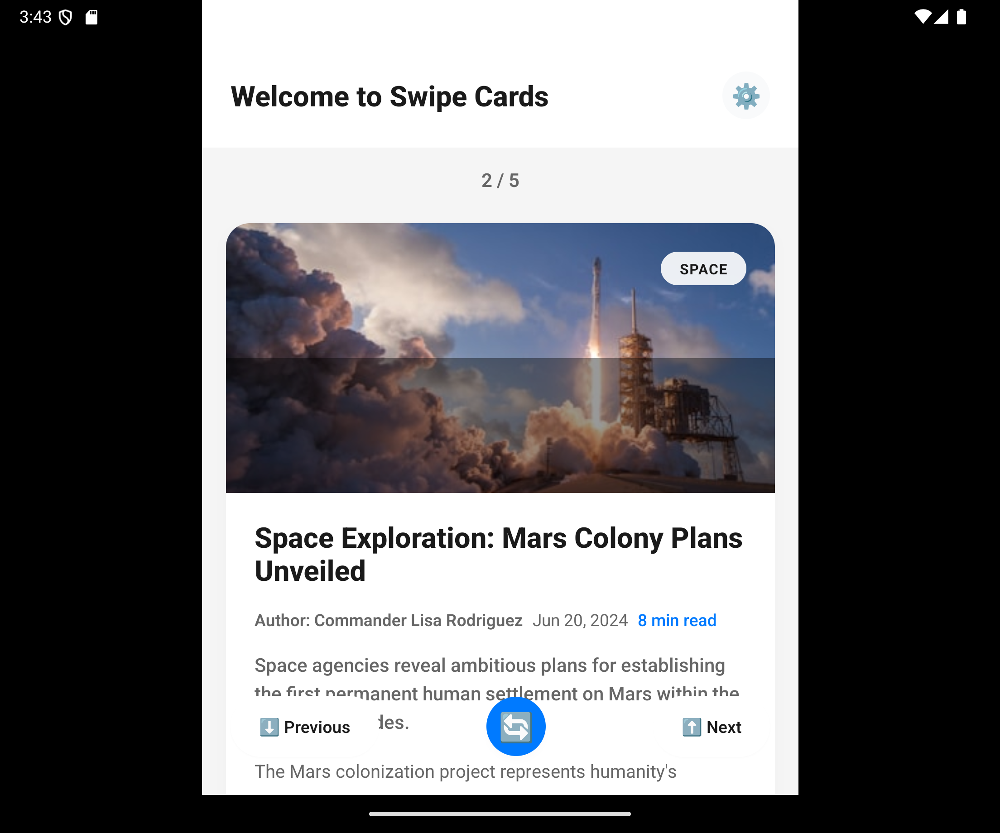
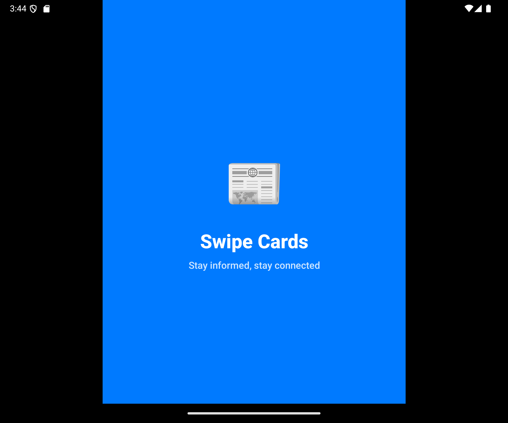

# 📰 Swipe Cards - React Native Boilerplate

A beautiful, modern news swiping application built with React Native and Expo. Swipe through news articles with smooth animations and an intuitive user interface.

## ✨ Features

- **🎯 Vertical Card Swiping**: Smooth, responsive card-based news browsing
- **🎨 Modern UI/UX**: Clean, polished interface with beautiful gradients and shadows
- **🌍 Internationalization**: Multi-language support (i18n) ready
- **📱 Cross-Platform**: Works on iOS, Android, and Web
- **⚡ Performance Optimized**: Efficient rendering and smooth animations
- **🔄 Error Handling**: Comprehensive error boundaries and user feedback
- **🎭 Splash Screen**: Professional app launch experience
- **📊 Type Safety**: Full TypeScript support
- **🎪 Interactive Elements**: Bookmark, share, and navigation controls

## 🛠 Technologies Used

- **React Native** (0.71.8) - Mobile app framework
- **Expo** (48.0.18) - Development platform
- **TypeScript** - Type safety and better developer experience
- **react-native-deck-swiper** - Card swiping functionality
- **expo-linear-gradient** - Beautiful gradient effects
- **i18n-js** - Internationalization support

## 🚀 Getting Started

### Prerequisites

- Node.js (v16 or later)
- npm or yarn
- Expo CLI
- iOS Simulator (for iOS development)
- Android Studio/Emulator (for Android development)

### Installation

1. **Clone the repository**
   \`\`\`bash
   git clone https://github.com/yourusername/swipe-cards-react-native-boilerplate.git
   cd swipe-cards-react-native-boilerplate
   \`\`\`

2. **Install dependencies**
   \`\`\`bash
   npm install
   \`\`\`

3. **Make Gradle executable (for Android)**
   \`\`\`bash
   chmod +x android/gradlew
   \`\`\`

4. **Start the development server**
   \`\`\`bash
   npm run start
   \`\`\`

5. **Run on your preferred platform**
   \`\`\`bash

   # iOS

   npm run ios

   # Android

   npm run android

   # Web

   npm run web
   \`\`\`

## 📱 Screenshots

<div align="center">
  
  
</div>

<p align="center">
  <em>Beautiful, swipeable news cards with smooth animations and modern UI</em>
</p>

## 🏗 Project Structure

```
swipe-cards/
├── src/
│   ├── components/
│   │   ├── commons/
│   │   │   ├── NewsCard.tsx          # Individual news card component
│   │   │   ├── NewsCardOld.tsx       # Legacy news card component
│   │   │   ├── NewsCardRefactored.tsx # Refactored news card component
│   │   │   └── ErrorBoundary.tsx     # Error handling component
│   │   ├── screens/
│   │   │   ├── HomeScreen.tsx        # Main app screen
│   │   │   ├── HomeScreenOld.tsx     # Legacy home screen
│   │   │   ├── HomeScreenRefactored.tsx # Refactored home screen
│   │   │   ├── SplashScreen.tsx      # App launch screen
│   │   │   ├── SplashScreenOld.tsx   # Legacy splash screen
│   │   │   └── SplashScreenRefactored.tsx # Refactored splash screen
│   │   ├── ui/
│   │   │   ├── ActionButtons.tsx     # Reusable action buttons
│   │   │   ├── CategoryBadge.tsx     # Category display component
│   │   │   └── MetaInfo.tsx          # Meta information component
│   │   └── index.ts                  # Component exports
│   ├── commons/
│   │   └── types/
│   │       ├── News.ts               # News-related TypeScript interfaces
│   │       └── i18n.ts               # Internationalization types
│   ├── constants/
│   │   └── index.ts                  # App constants
│   ├── data/
│   │   └── mockNews.ts               # Mock news data
│   ├── hooks/
│   │   └── useNewsSwiper.ts          # Custom hook for news swiping logic
│   ├── services/
│   │   └── internationalization/
│   │       ├── i18n.ts               # i18n configuration
│   │       ├── i18n.utils.ts         # i18n utility functions
│   │       └── translations/         # Translation files directory
│   ├── theme/
│   │   └── index.ts                  # Design system (colors, typography, etc.)
│   ├── utils/
│   │   └── helpers.ts                # Utility functions
│   └── __tests__/
│       └── helpers.test.ts           # Unit tests
├── assets/                           # Static assets
│   ├── adaptive-icon.png
│   ├── favicon.png
│   ├── icon.png
│   └── splash.png
├── images/                           # Screenshot images
├── android/                          # Android-specific files
├── App.tsx                           # Main App component
├── index.js                          # Entry point
├── package.json                      # Dependencies and scripts
├── tsconfig.json                     # TypeScript configuration
├── babel.config.js                   # Babel configuration
├── metro.config.js                   # Metro bundler configuration
├── app.json                          # Expo app configuration
├── eas.json                          # Expo Application Services configuration
├── config.ts                         # App configuration
├── environment.ts                    # Environment variables
└── README.md                         # Project documentation
```

## 🎨 Customization

### Adding News Data

Update the \`mockNewsData\` array in \`src/components/screens/HomeScreen.tsx\` with your news content:

\`\`\`typescript
const newsData: News[] = [
{
id: 1,
title: "Your News Title",
description: "Brief description...",
content: "Full article content...",
image: "https://your-image-url.com/image.jpg",
date: "2024-06-22",
author: "Author Name",
category: "Technology",
readTime: 5,
// ... other properties
},
// Add more news items...
];
\`\`\`

### Customizing Theme

Modify colors, typography, and spacing in \`src/theme/index.ts\`:

\`\`\`typescript
export const Colors = {
primary: '#007AFF', // Change primary color
secondary: '#FF9500', // Change secondary color
// ... other colors
};
\`\`\`

### Adding Translations

Add new language files in \`src/services/internationalization/translations/\`:

\`\`\`json
// es.json (Spanish)
{
"welcome": "Bienvenido a News Swiper",
"loading": "Cargando noticias...",
// ... other translations
}
\`\`\`

## 🔧 Available Scripts

- \`npm start\` - Start the Expo development server
- \`npm run android\` - Run on Android device/emulator
- \`npm run ios\` - Run on iOS device/simulator
- \`npm run web\` - Run on web browser
- \`npm run build:android\` - Build Android APK/AAB
- \`npm run build:ios\` - Build iOS app
- \`npm run build:all\` - Build for all platforms

## 📋 Potential Future Features

- [ ] Integrate with real news API
- [ ] Add offline support
- [ ] Implement user preferences
- [ ] Add dark mode theme
- [ ] Social sharing functionality
- [ ] Push notifications
- [ ] User authentication
- [ ] Bookmark persistence
- [ ] Search functionality
- [ ] Categories filter

## 🤝 Contributing

1. Fork the repository
2. Create your feature branch (\`git checkout -b feature/AmazingFeature\`)
3. Commit your changes (\`git commit -m 'Add some AmazingFeature'\`)
4. Push to the branch (\`git push origin feature/AmazingFeature\`)
5. Open a Pull Request

## 📄 License

This project is licensed under the MIT License - see the [LICENSE](LICENSE) file for details.

## 🙏 Acknowledgments

- [react-native-deck-swiper](https://github.com/alexbrillant/react-native-deck-swiper) - For the amazing cards
- [Expo](https://expo.dev/) - For the excellent development platform
- [Unsplash](https://unsplash.com/) - For the beautiful placeholder images

## 📞 Support

If you like this project, please consider:

- ⭐ Starring the repository
- 🐛 Reporting bugs
- 💡 Suggesting new features
- 🤝 Contributing to the codebase

---

**Happy coding!** 🎉
